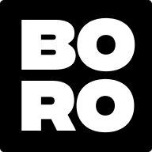

<p align="center">
  <a href="https://boro-blogs.netlify.app">
    
  </a>
</p>
<h1 align="center">
  Boro Blog: Theme by Lupin | Built with Gatsby
</h1>

## ✨ Features

- MDX
- Fully customizable through the usage of Gatsby Themes (and Theme UI)
- Light Mode / Dark Mode
- Typography driven, minimal style
- Tags/Categories support
- Code highlighting with [prism-react-renderer](https://github.com/FormidableLabs/prism-react-renderer) and [react-live](https://github.com/FormidableLabs/react-live) support. Also allows adding line numbers, line highlighting, language tabs, and file titles.
- RSS Feed for blog posts
- Google Analytics Support
- SEO (Sitemap, OpenGraph tags, Twitter tags)
- Offline Support & WebApp Manifest

## 🚀 To get the starter

1. **Create a Gatsby site.**

Use the Gatsby CLI to create a new site, specifying this project

```sh
gatsby new project-name https://github.com/LekoArts/gatsby-starter-minimal-blog
```

2. **Start developing.**

Navigate into your new site's directory and start it up.

```sh
cd project-name
gatsby develop
```

3. **Open the code and start customizing!**

Your site is now running at `http://localhost:8000`!

If you want to learn more about how you can use a Gatsby starter that is configured with a Gatsby theme, you can checkout this [shorter](https://www.gatsbyjs.org/docs/themes/using-a-gatsby-theme/) or [longer](https://www.gatsbyjs.org/tutorial/using-a-theme/) tutorial. The tutorials don't exactly apply to this starter however the concepts are the same.
