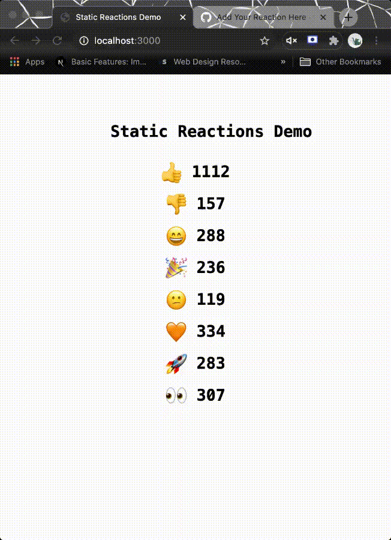

Next.js has introduced a very handy feature called Incremental Static Re-generation from versions 9.5 and above. It has been five months now since v9.5, nonetheless, I thought the feature was really cool and I had to try it out.

## What is Incremental Static Re-generation?

Incremental Static Re-generation is basically a way to update static content on your sites. As we know using methods like Static Site Generation (SSG), we can pre-render sites (fetch data at build-time) and deliver content blazingly fast. While Next.js cares about delivering content almost instantly, they equally care about handling stale data or dealing with dynamic data.

Rebuilding a website for every update could be a tedious task. The Incremental Static Re-generation feature deals with all the updates gracefully. Existing pages are updated by re-rendering them in the background as traffic comes in.

For every incoming traffic, background regeneration pushes the newly-generated page after it's done generating, without any interruption.

> We can use `fallback: true` option to fallback on stale version of the website when a newer version is being generated. Also, fallback is useful when someone requests a page that’s not generated yet.

## High-level Architecture

Here in the diagram, we can see User-1 requesting data from an endpoint (/post/1). While the request is made, User-1 immediately receives a stale response of the request (already generated data). At the same time, another request is triggered to update the data which subsequently re-generates the page with the updated data.

<div className="Image__Small">
  
</div>

User-2 when making the request to the same endpoint isn't served with the stale data, since the re-generated and updated data is now available.

To enable this feature, one has to configure the interval for re-generation in the `getStaticProps` function of the particular page.

- Incremental static re-generation gives you offloads database and backend load while allowing dynamic content.

## An Example: Reaction app

The following application demonstrates the feature of Incremental Static Re-generation. It re-generates a static page that shows the count of various GitHub reactions of a Github issue available [here.](https://reactions-demo.now.sh/)

<!-- <GifVideo src="./images/gif.gif"/> -->

The application above is demonstrated in the Next.js blog available [here](https://nextjs.org/blog/next-9-5#stable-incremental-static-regeneration). Please try it out on your own.

## Code in-depth

Let us have a quick review of the code and understand how that works. The asynchronous `getStaticProps` method statically generates and fetches data at build time. We make a query that makes a request to a GitHub endpoint. The query resolves to the content (emoji reactions) of the issue we want to grab from a particular repository.

### Querying an endpoint:

```js
// getStaticProps()

export async function getStaticProps() {
  const res = await fetch('https://api.github.com/graphql', {
    method: 'POST',
    headers: {
      Authorization: `bearer ${process.env.GITHUB_TOKEN}`,
    },
    body: JSON.stringify({
      query: `query {
        repository(owner:"chibicode", name:"reactions") {
          issue(number:1) {
            reactionGroups {
              content
              users(first: 0) {
                totalCount
              }
            }
          }
        }
      }`,
    }),
  });
```

Note: To run this file locally you would need a GitHub access token. Generate one for yourself [here.](https://github.com/settings/tokens)

### Resolving request:

The code below handles the response and maps through the reactions available.

```js {15}
const json = await res.json();
if (res.status !== 200) {
  console.error(json);
  throw new Error('Failed to fetch API');
}

const reactions = json.data.repository.issue.reactionGroups.map(
  (item) => item.users.totalCount
);
```

The data received is an array of objects like so. Each of these items is mapped through and the object property called 'totalCount' has the figure stored that indicates the total number of reactions for each emoji.

```js
// console.log(json.data.repository.issue.reactionGroups)

reactions = [
  { content: 'THUMBS_UP', users: { totalCount: 1111 } },
  { content: 'THUMBS_DOWN', users: { totalCount: 158 } },
  { content: 'LAUGH', users: { totalCount: 288 } },
  { content: 'HOORAY', users: { totalCount: 236 } },
  { content: 'CONFUSED', users: { totalCount: 119 } },
  { content: 'HEART', users: { totalCount: 334 } },
  { content: 'ROCKET', users: { totalCount: 283 } },
  { content: 'EYES', users: { totalCount: 307 } },
];
```

Right after, we then expose the reactions as props to be consumed by a component. We also have a revalidate count (here as 1) that indicates the number of seconds to wait from the moment a request comes in for the regeneration.

```js
return {
    props: {
        reactions,
        },
    revalidate: 1,
    };
}
```

We can only imagine Next.js to skyrocket with this great feature available out-of-the-box. It's a really cool feature and results in a fast, reliable, and secure browsing experience.

## References

- The GitHub repo for the demo application can be found [here.](https://github.com/Boro23-wq/reactions)
- [Incremental Static Re-generation - Next.js.](https://nextjs.org/blog/next-9-5#stable-incremental-static-regeneration)
- [Github issue whose reactions were recorded.](https://github.com/chibicode/reactions/issues/1)
