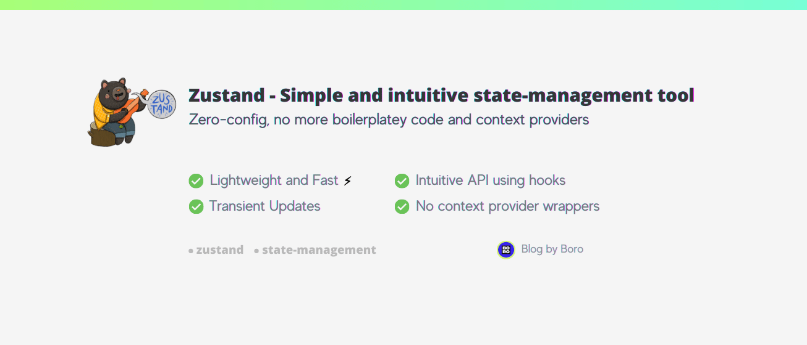

[Zustand](https://github.com/pmndrs/zustand) is a pretty neat state-management tool. When I say state-management, you might as well want it to be compared with Redux or Context. But, this blog wouldn't be the typical rundown of pros and cons and comparing technologies as every technology has its own pros and cons. Instead, we are going to have a look at how Zustand makes it easy to get started with handling state on your applications.

By any chance, if you are looking for a top-hole definition of Zustand, here it is:

> It is a small, fast and scaleable barebones state-management solution. It has a pretty neat API based on hooks and isn't boilerplatey at all to start with.

## Get started

To get started with Zustand you would need its npm package. You can download it from npm using:

```bash
npm install zustand
```

### Create a store

Once we are done installing the package we can go ahead and create the store. Creating a store is as easy as it can get. We have a really basic example of how we can create a store and then access the store within a components.

```js
import create from 'zustand';

const useStore = create((set, get) => ({
  count: 0,
  incrementCount: () => set((state) => ({ count: state.count + 1 })),
  resetCount: () => set({ count: 0 }),
}));
```

'create' in Zustand provides us with two different methods 'set' and 'get'. The naming is probably self-explanatory of its purpose. The 'Set' method is used to set/merge the state, while the 'Get' method helps us to access the state in the store.

### Bind within components

Right after creating the store, we can access the hook anywhere in our component like so. Neat and easy! Note, there is no extra provider required to access the state. Just select the state you want access to and Zustand will take care of re-rendering the component when the state changes.

```js
function Counter() {
  const count = useStore((state) => state.count);
  return <p>Count: {count}</p>;
}

function IncrementCounter() {
  const increaseCount = useStore((state) => state.incrementCount);
  return <button onClick={incrementCount}>Increment</button>;
}
```

Function 'Counter' grabs the value of count stored in the state and displays it within `p` tags, while 'IncrementCounter' performs mutation to the state by incrementing the state value.

Zustand simply makes life easier without needing to write too much code and its intuitive hooks API is sleek to be fair.

## Fetch everything or slices from multiple states

While you can fetch the entire state entity all at once, it is not recommended since every state change will cause a re-render of the component. Fetching everything can be implemented as:

```js
const state = useStore();
```

With Zustand we can also grab slices of multiple states without fetching everything right away. It is very helpful if you want to perform atomic state-picks.

```js
const nuts = useStore((state) => state.nuts);
const honey = useStore((state) => state.honey);
```

Additionally, we can also define an object that performs multiple state-picks.

```js
import shallow from 'zustand/shallow';

const { nuts, honey } = useStore(
  (state) => ({ nuts: state.nuts, honey: state.honey }),
  shallow
);
```

'shallow' allows us to trigger state update when keys of the object change or update. The above code will trigger a re-render when either of `state.nuts` or `state.honey` changes.

## Performing asyncronous actions

Let's not forget every time we build an application we somehow always need to reach out to an API for some data. And fortunately, Zustand has taken care of performing async actions for us.

```js
const useStore = create((set) => ({
  dataHouse: {},
  fetch: async (url) => {
    const res = await fetch(url);
    set({ dataHouse: await res.json() });
  },
}));
```

I'm certainly mind-blown by how much work we can actually do with Zustand's intuitive and clean API. I would highly recommend you to check out a few other features available with Zustand. For me, it was a kind experience for the fact that I didn't need many configs to start with (literally zero-config upfront). It is pretty much convenient how simple the implementations are. If you want to try out a simple React application using Zustand, you can visit [here](https://codesandbox.io/s/dazzling-moon-itop4) and get a taste of convenience for yourself.
